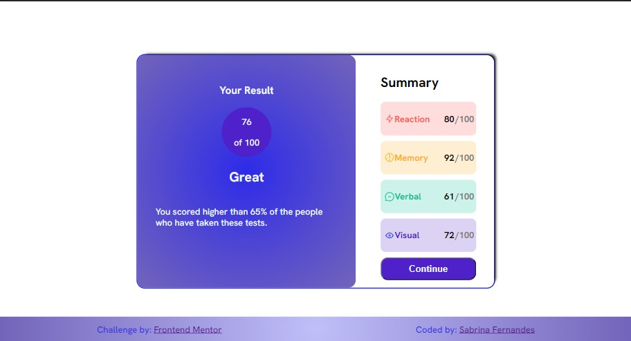
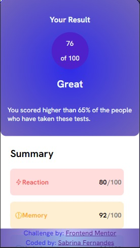
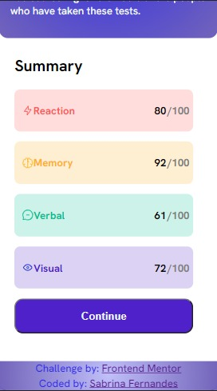

# Frontend Mentor - Results summary component solution

This is a solution to the [Results summary component challenge on Frontend Mentor](https://www.frontendmentor.io/challenges/results-summary-component-CE_K6s0maV).

## Table of contents

- [The challenge](#the-challenge)
- [Screenshot](#screenshot)
- [Built with](#built-with)
- [Continued development](#continued-development)
- [Author](#author)

### The challenge

Users should be able to:

- View the optimal layout for the interface depending on their device's screen size

### Screenshot

  
  
   

### Built with

- HTML5
- CSS
- Flexbox

### Continued development

I intend to improve my skills with html and css and apply the Tailwind framework in future projects, as well as using mobile first in styling.

-----

Eu pretendo melhorar minhas habilidades com html e css e aplicar o framework Tailwind em projetos futuros, bem como usar mobile first na estilização.

## Author

- Frontend Mentor - [Sabrina Fernandes](https://www.frontendmentor.io/profile/sabrinapratafernandes)
